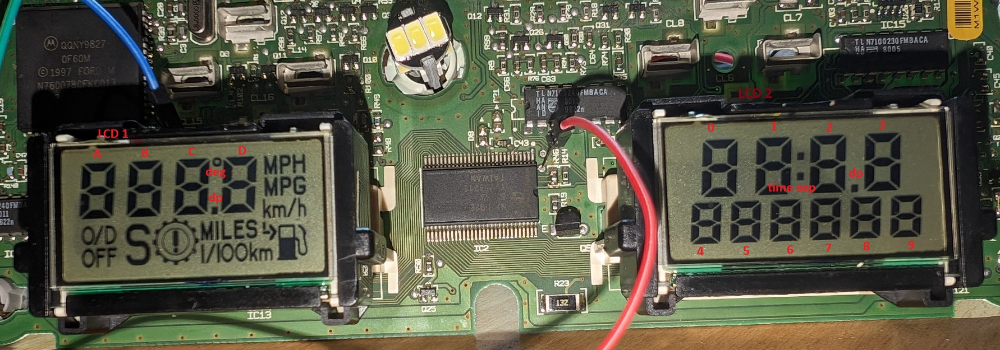
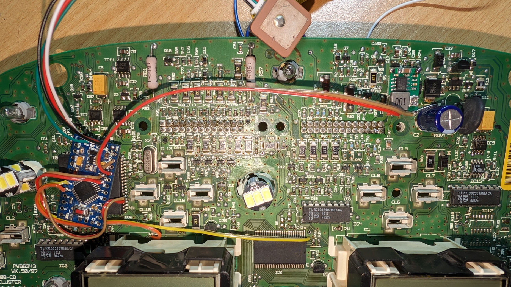
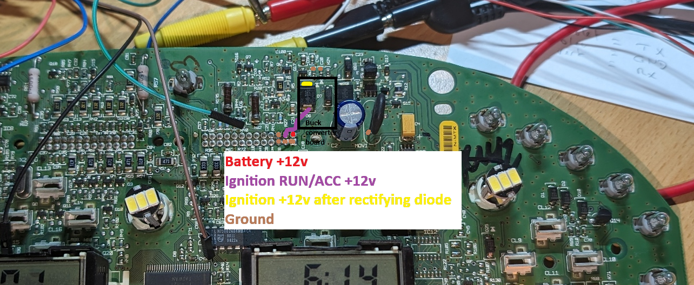
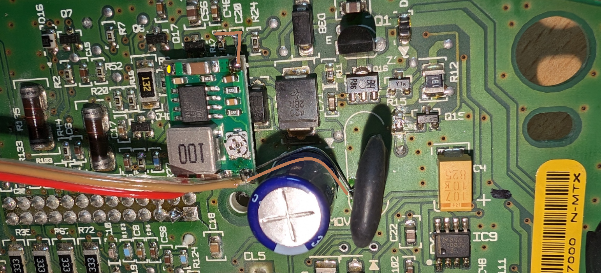
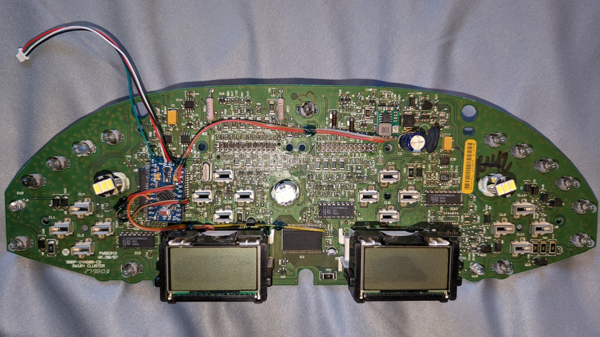
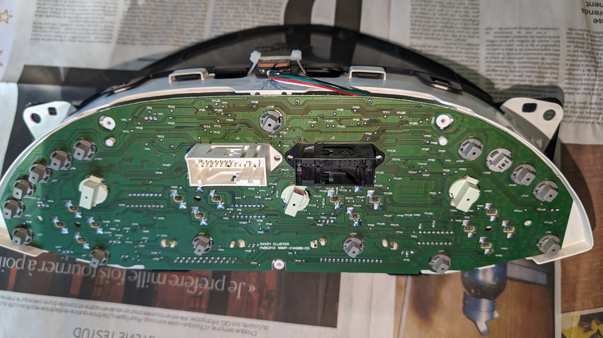
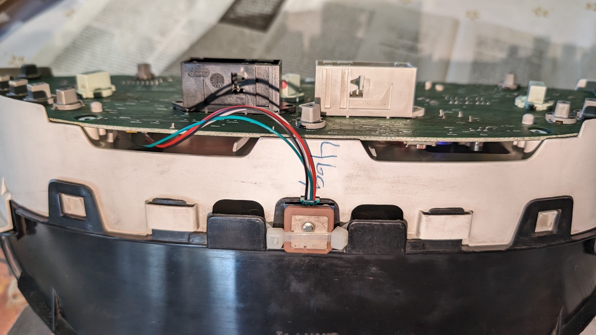
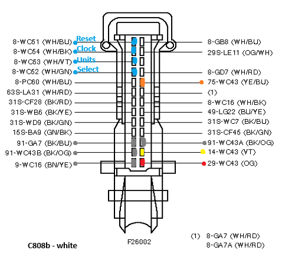
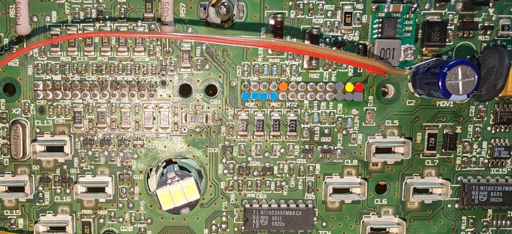
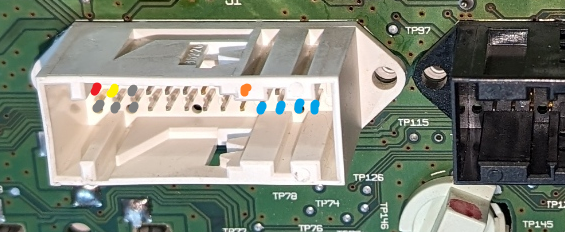

# What is this project?
**Ford Cougar Enhanced Cluster** is a "spin-off" of a similar but way more complex project I am developing dedicated to the Chrysler LH platform. This project can be used to interface an Arduino or similar AVR microcontroller with the LCD driver of a 1998-2002 Ford/Mercury Cougar.

The heart of the 1998-2002 Cougar's cluster is a Motorola MC68HC11 microcontroller. It uses I2C to communicate with the LCD driver manufactured by Philips, which unfortunately has a custom part number. After some reverse engineering and comparing datasheets, I made an educated guess and figured out the driver was a PCF8576. You can find [the datasheet here](resources/PCF8576.pdf). 

My goal was to display the GPS speed of the car in place of the useless average speed than can be displayed on the trip computer. 
Cut the I2C traces between the MC68HC11 and the PCF8576, connect an Arduino in-between (I used a Nano for testing, and a Pro Mini in "production"), add a U-Blox based GPS receiver such as a Beitian BN-180, power everything from the fused ignition +12 volts supply from the cluster itself, and you get yourself a GPS speedometer.

I also decided to display the GPS time on the clock so I don't have to set the time anymore ;). The source code can be modified to set your own timezone and winter to summer time change. 

${{\color{Red}{\Huge{\textsf{A few words of caution!}}}}}\$

***Be careful! This mod involves cutting very thin traces on your cluster motherboard! This could kill it!***

***You don't have to take the whole cluster apart, the PCB can be removed without disturbing the needles. Simply remove the back cover plastic plate (5 small Torx screws) and pry the board out. The needle motor pins are only pressure fits, they will come loose with a bit of force.***

***Please keep in mind this project has been designed with the 1998 model in mind! Here the Motorola is masked "0F60M" even if the PLCC-68 form factor don't match the datasheet of the MC68HC11 series, and the LCD driver has the custom part number N710020CFDC000. Make sure you have the same hardware on your cluster before doing anything! All this MIGHT NOT APPLY to other years!***

# I2C protocol
The I2C bus is "mastered" my the MC68HC11 with internal pull-up resistors. The slave LCD driver responds on address 0x38. Every time the MC68HC11 wants to update data on the LCD, it sends a message over the I2C bus made of commands first, and then data to display. The commands are well explained in the PCF8576 datasheet at page 23. 

Technically, the master can send up to the 5 available commands to the LCD driver... So it needs to know where the commands stop and where the display data start in the message which could potentially be 26 bytes long! For that, it will look at the first byte with its most significant bit set to 0 (in other words, is the byte less than 0x80?), this byte will be the last command sent. All the rest will be display data.

In practice, only 16 bytes of data will be used on the cluster because some outputs of the driver are not used. The LCDs have less inputs than the driver has outputs. It took me a long time, but I was able to map all the pixels on both the 2 LCDs...

# Where to cut traces on the PCB
We need to disconnect the PCF8576 chip from the Motorola microchip so the Arduino can intercept I2C messages from the microchip and send the altered (or not) messages to the LCD driver. 

First, locate the SDA and SDL traces from the microchip. The SCL trace can be cut on the front side of the PCB, right before the TP28 test point (label on the back side). The small trace running between the SCL and SDA traces from the microchip to TP28 is only a ground plane trace, damages to this trace should not be a problem.

Cut the SDA trace on the back side of the PCB, right before the TP27 test point. Same here, the trace between SDA and SCL is only a ground plane trace...

Connect the Arduino pins as follow:
- Analog 4: MC86HC11 pin 48 - SCL from Motorola
- Analog 5: MC68HC11 pin 47 - SDA from Motorola
- Digital 4: Test point TP 27 - SDA from PCF8576 pin 1
- Digital 5: Test point TP 28 - SCL from PCF8576 pin 2

Since I planned on gluing the Arduino on the MC68HC11 I decided to solder one of the Arduino's ground pins directly on the MC68HC11 pin 61 which is ground. This should provide a good anchor for the Arduino. 

For powering the Arduino and the GPS receiver, I decided to solder a small "buck converter" board, sold on Amazon as DSN-MINI-360 DC to DC buck converter, on top of the rectifying diode. 
- The IN+ (positive input) of the buck converter will be soldered on the yellow pad of the diode.
- The IN- (negative input) and OUT- (negative output) will be connected to ground.
- The OUT+ (positive output) will go to the Arduino +5v power rail, after its own voltage regulator.

**ALWAYS MAKE SURE IN ADVANCE the buck converter is properly adjusted to 5.00 volts before connecting the OUT+ converter's output to the Arduino power rail! Damages to the Arduino and the cluster could occur.**

This is a view if the buck converter board in place. OUT- goes to the Arduino and to the varistor MOV1 ground pin. IN- goes to R17 and C20 components (top pads) to reinforce the entire assembly. The board itself rests on the diode (the ground plane on the converter PCB should prevent noise). IN+ goes to the diode D6's cathode (top pad).

Everything is now ready. The Arduino board is taped onto the MC68HC11 with double-sided tape and the flying wires are hold securely on the cluster's PCB with some UV cured resin. This resin was also used to cover the exposed copper traces. The flying wire with a connector at the end goes to the GPS receiver: 

| GPS pin 	| Arduino pin 	|
|---------	|-------------	|
| GND     	| GND         	|
| 5V      	| 5V          	|
| TX      	| RX          	|
| RX      	| TX          	|

Final assembly... The GPS receiver is locked into place with the help of zip ties. 

The connector on the GPS receiver would not lock properly so I decided to lock it up in place with some UV resin. 

# Can I test this on the bench?
Yes! Here is the pinout for the white connector. The connector itself has a standard 2.54mm/0.1" pitch, it is compatible with regular "Arduino" or "Raspberry" header cables.

| Circuit  	| Function                                                                                 	|
|----------	|------------------------------------------------------------------------------------------	|
| ${{\color{Gray}{\textsf{9-WC16}}}}\$   	| Ground - All connected together on the cluster PCB, you can use any of them as ground    	|
| ${{\color{Gray}{\textsf{91-WC43B}}}}\$ 	| Ground - All connected together on the cluster PCB, you can use any of them as ground    	|
| ${{\color{Gray}{\textsf{91-GA7}}}}\$   	| Ground - All connected together on the cluster PCB, you can use any of them as ground    	|
| ${{\color{Gray}{\textsf{91-WC43A}}}}\$ 	| Ground - All connected together on the cluster PCB, you can use any of them as ground    	|
| ${{\color{Red}{\textsf{29-WC43}}}}\$  	| Battery +12v - Hot at all time                                                           	|
| ${{\color{Yellow}{\textsf{14-WC43}}}}\$  	| Ignition ACC/RUN +12v - Hot when the key is in the ACC or RUN position                   	|
| ${{\color{Orange}{\textsf{75-WC43}}}}\$  	| Ignition signal - Connect to 14-WC43 Ignition +12v to wake the cluster up               	|
| ${{\color{#00A2E8}{\textsf{8-WC51}}}}\$   | Trip computer switch RESET (connect to ground to simulate a press on the RESET button)	|
| ${{\color{#00A2E8}{\textsf{8-WC52}}}}\$   | Trip computer switch SELECT (connect to ground to simulate a press on the SELECT button)	|
| ${{\color{#00A2E8}{\textsf{8-WC53}}}}\$   | Trip computer switch UNITS (connect to ground to simulate a press on the UNITS button)	|
| ${{\color{#00A2E8}{\textsf{8-WC54}}}}\$   | Trip computer switch CLOCK (connect to ground to simulate a press on the CLOCK button)	|

